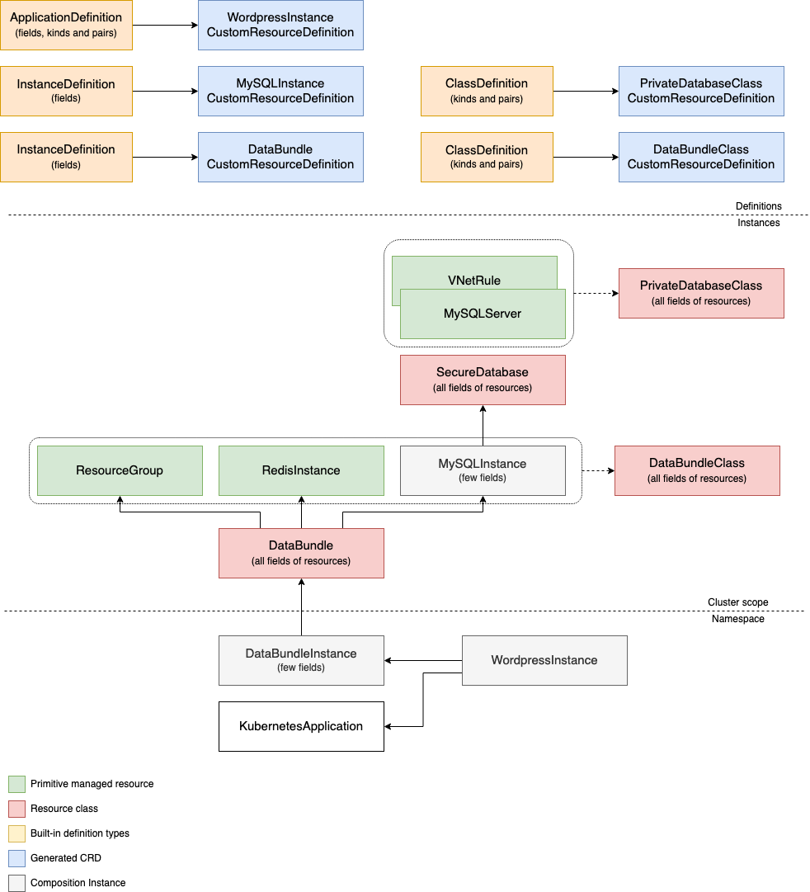

* Static provisioning doesn't exist in the sense that you create a composite resource without any class.
  * You can create an `InstanceDefinition` that is cluster-scoped and use it as intermediary resource. For example, `MySQLInstance` in the diagram is a cluster-scoped resource. You can create it and use it in another composition whose instance is namespaced but you always need a class to get all of the parameters for initial creation.
  * As an alternative, we can have intermediary resource kinds that is generated from `ClassDefinition` together with class, i.e. `PrivateDatabase` and `PrivateDatabaseClass`; both with all fields of the underlying resources. Then we'd not need a class, creating `PrivateDatabase` with necessary fields would be sufficient. Though it's similar to what we have today, composition adds another layer and that results in some complexity. So, it depends how much we want static provisioning to be first class scenario.

* Application composition is different from infrastructure in the sense that you define everything (actual parameters of primitive resources, instance fields and their corresponding fields on primitive resources). You don't have _class_ concept, it's all under one resource `ApplicationDefinition`. If you want to deploy Wordpress to VM and Kubernetes, you have to create two different `ApplicationDefinition`s and use two different CR kinds for each (`VMWordpress` and `K8SWordpress`). Similar reasoning with kind separation of `Deployment` and `StatefulSet` where both kinds get you the same output but you choose one or the other over how they handle the app's pods.
